# Yarn和Spark对比
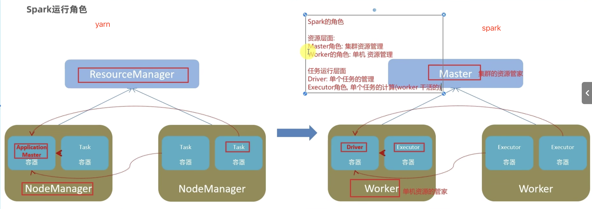

# Standalone架构（并行环境下）
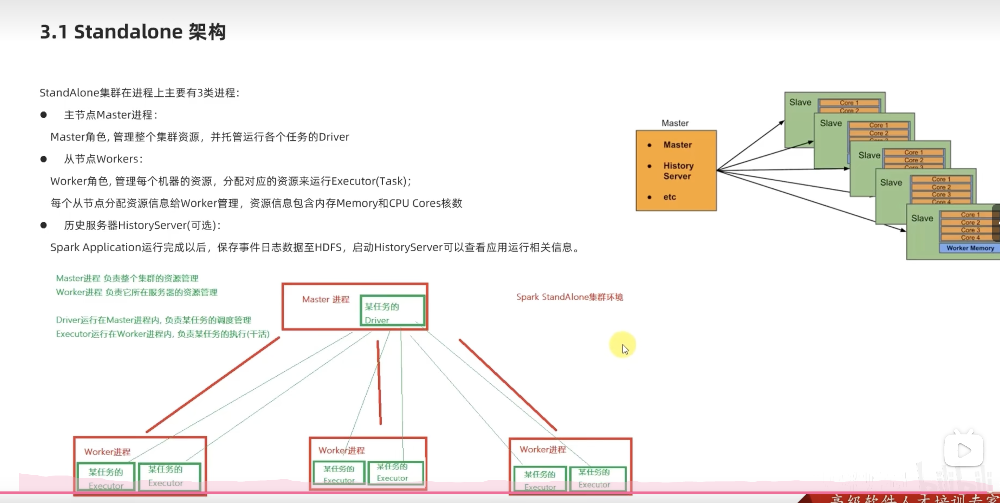

# spark的配置文件
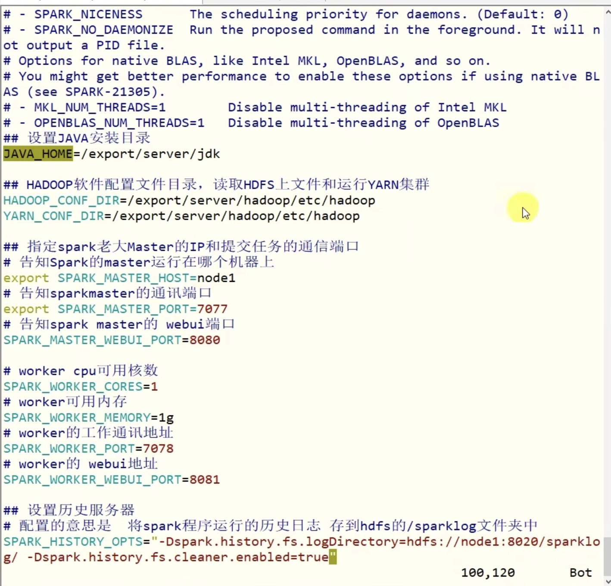

# 一般默认的webui端口
- master的端口8080
- driver的端口4040
- history的端口18080
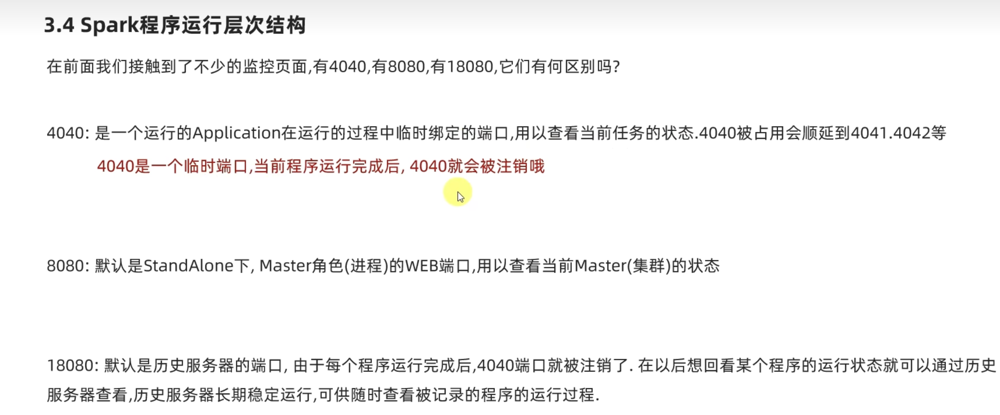

# 运行层级划分
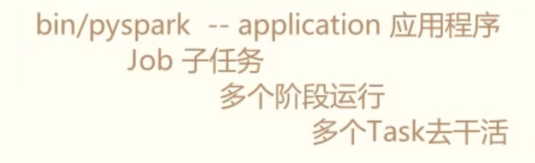

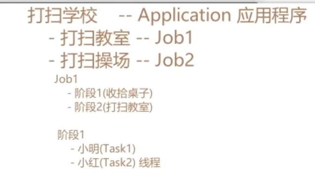

# 避免master崩溃造成单点崩溃问题
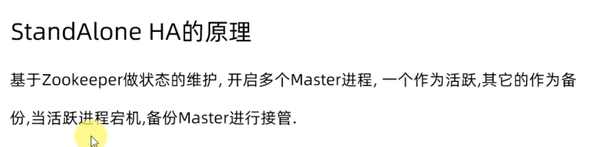

# spark on yarn
## 本质
将spark程序提交到yarn中，yarn来充当master和worker角色来管理资源，在yarn容器内部创建driver来进行数据处理。
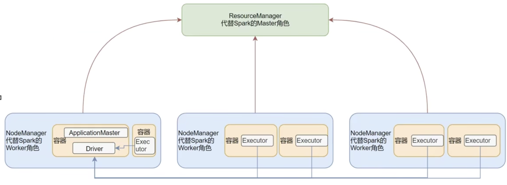
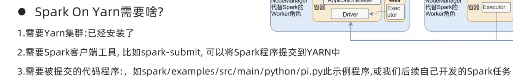

## 两种模式：Cluster和Client
- Cluster：集群模式，在yarn容器内部创建driver进程，所有的通讯都在容器内部完成，通讯成本低，但是需要去容器内部查看日志，不方便
- Client：客户端模式，在客户端内创建driver进程，通讯成本高，但是日志输出在客户端内，方便查看。

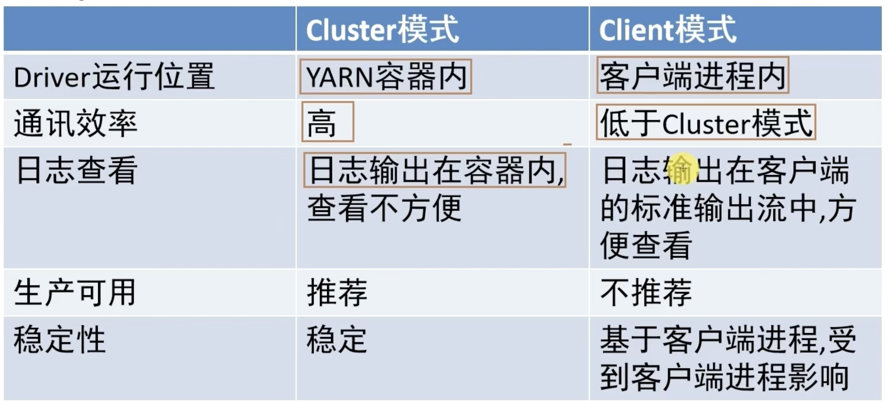

## yarn模式流程
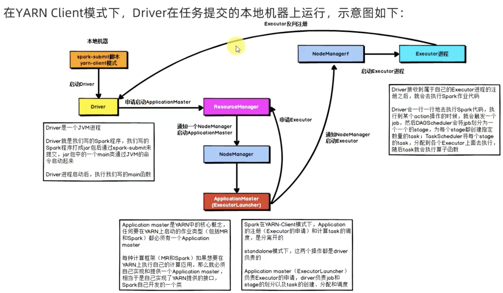
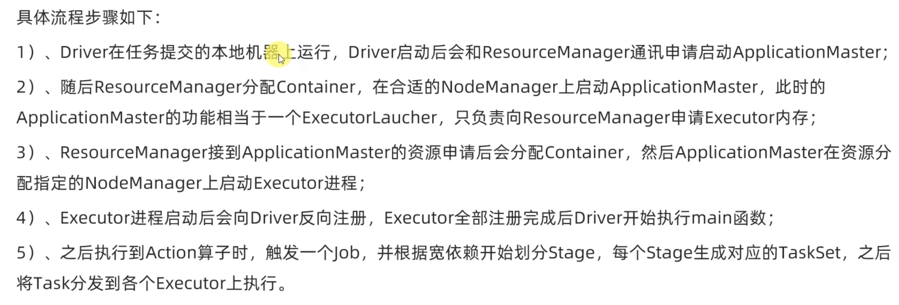

# pyspark代码的原理（相对于java/scala）
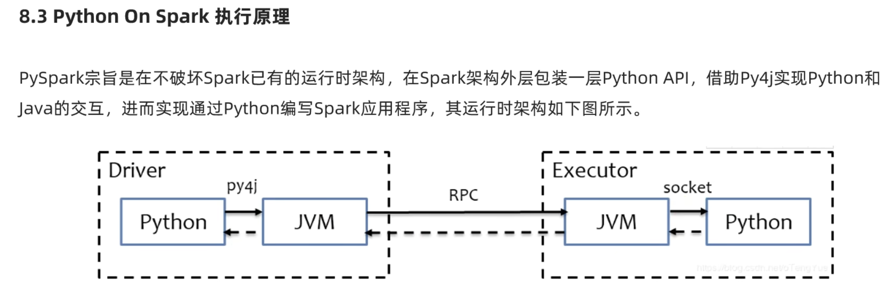
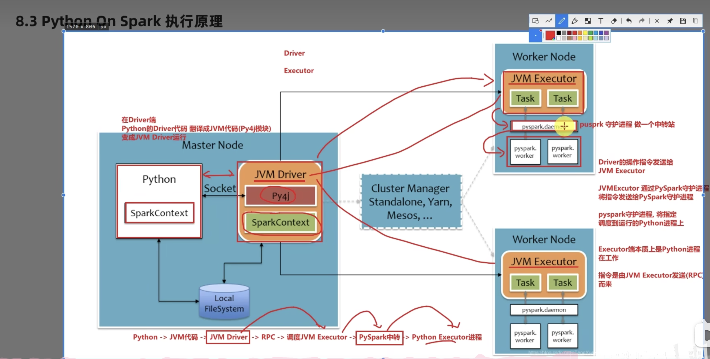

# SparkCore知识点

## RDD
### RDD定义
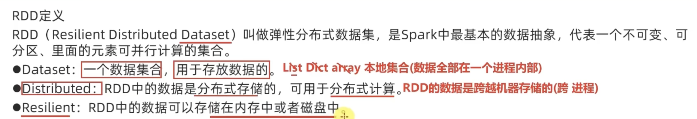

### RDD特性
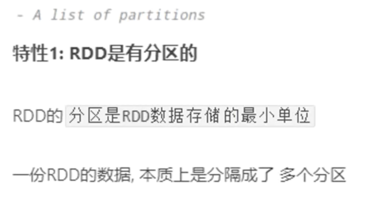

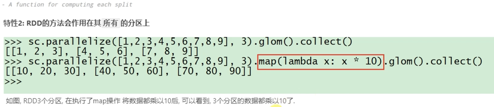

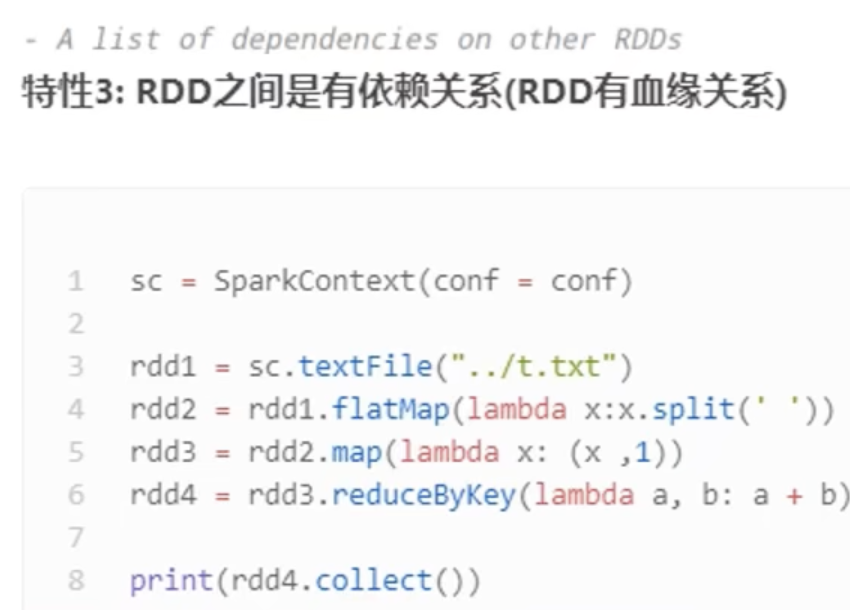

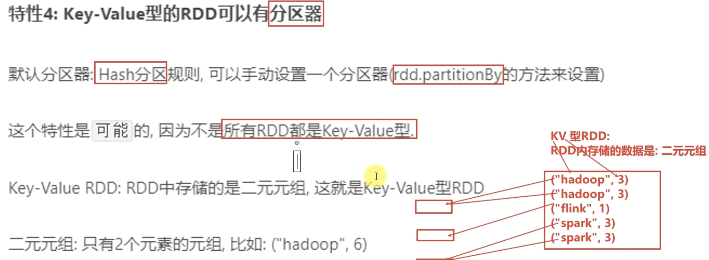

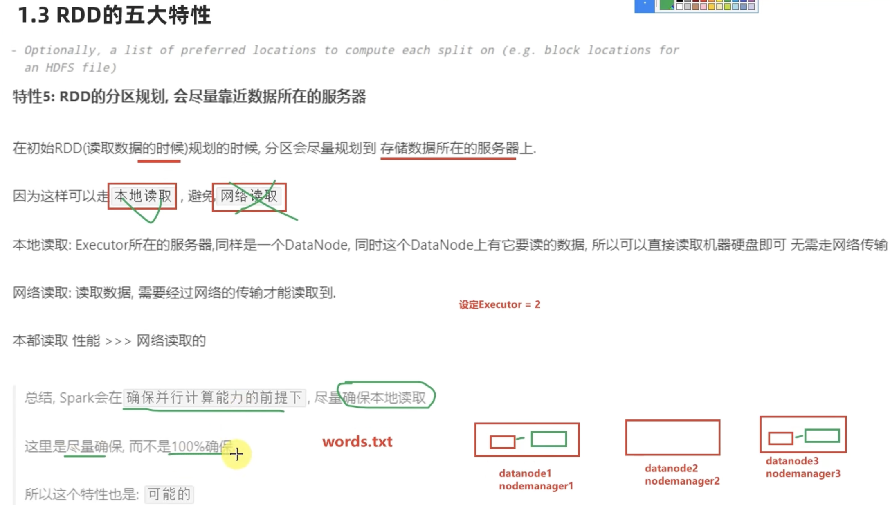