# Yarn和Spark对比


# Standalone架构（并行环境下）


# spark的配置文件


# 一般默认的webui端口
- master的端口8080
- driver的端口4040
- history的端口18080


# 运行层级划分


# 避免master崩溃造成单点崩溃问题


# spark on yarn
## 本质
将spark程序提交到yarn中，yarn来充当master和worker角色来管理资源，在yarn容器内部创建driver来进行数据处理。


## 两种模式：Cluster和Client
- Cluster：集群模式，在yarn容器内部创建driver进程，所有的通讯都在容器内部完成，通讯成本低，但是需要去容器内部查看日志，不方便
- Client：客户端模式，在客户端内创建driver进程，通讯成本高，但是日志输出在客户端内，方便查看。


## yarn模式流程


# pyspark代码的原理（相对于java/scala）


# SparkCore知识点

## RDD
### RDD定义


### RDD特性


## DAG（有向无环图）
### job划分：
整个任务可能会有很多job，一个job对应一个DAG
### 宽窄依赖的划分
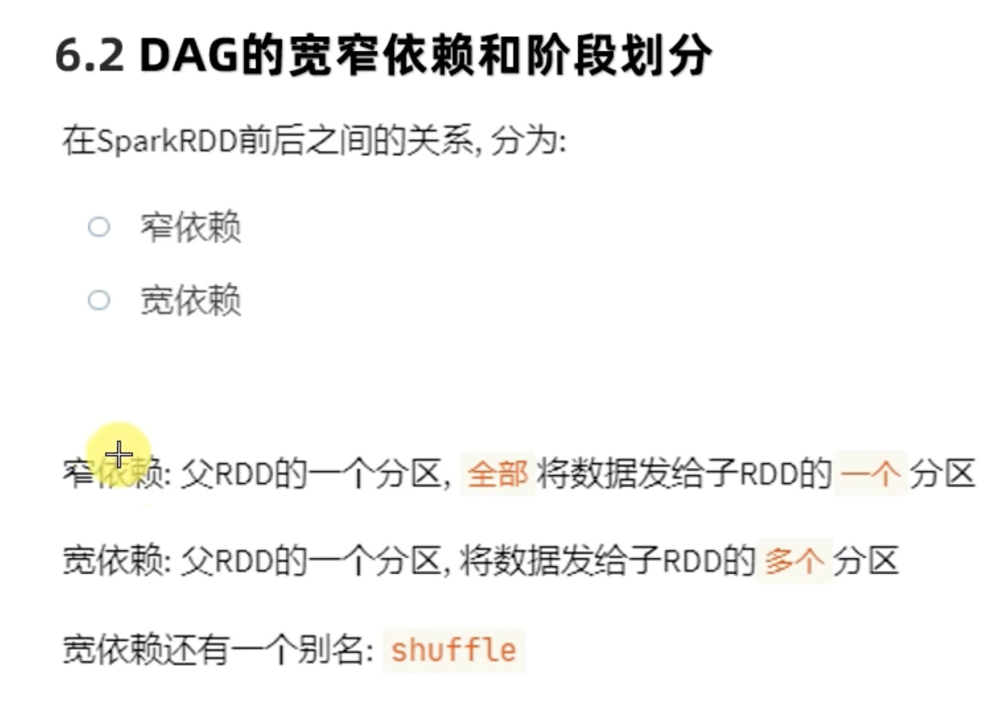
### stage的划分
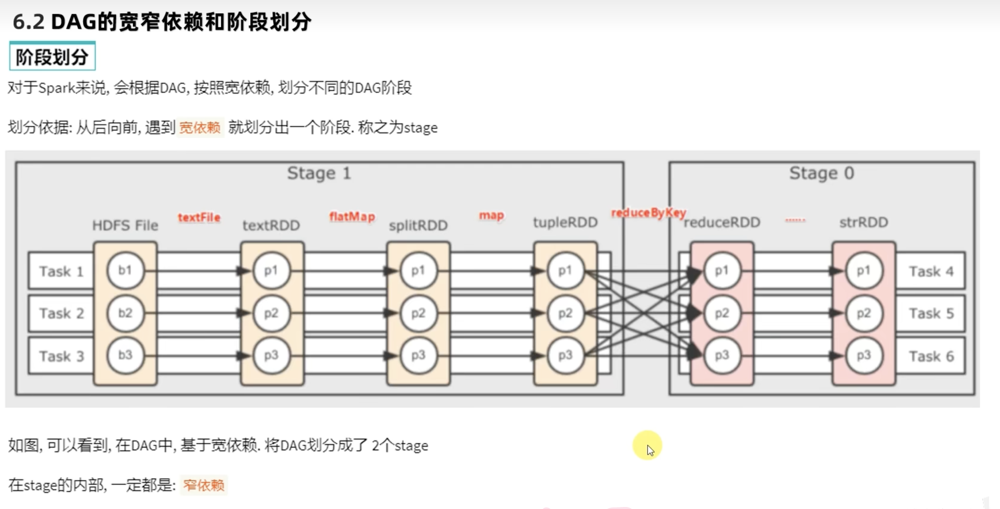
### 内存迭代计算
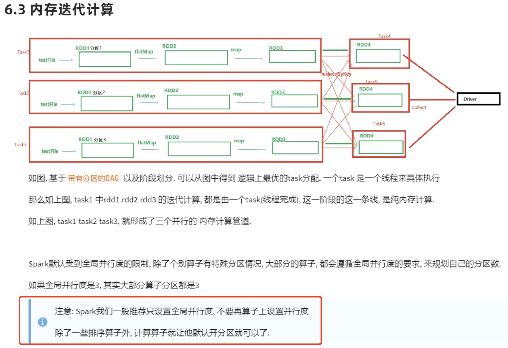
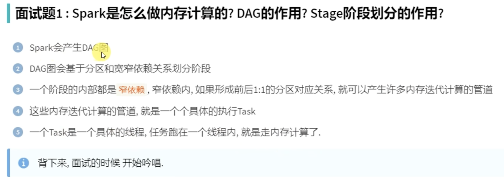
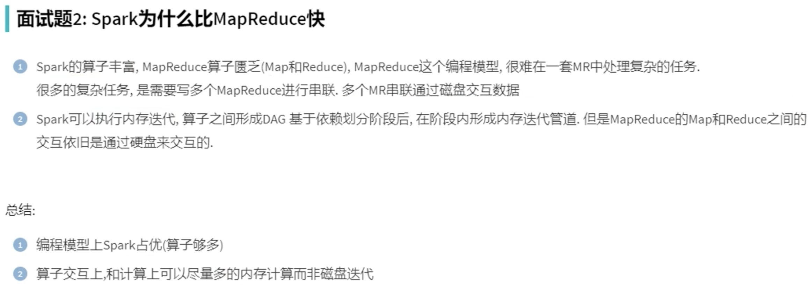

## spark并行度的规划---先有并行度规划才确定有几个分区
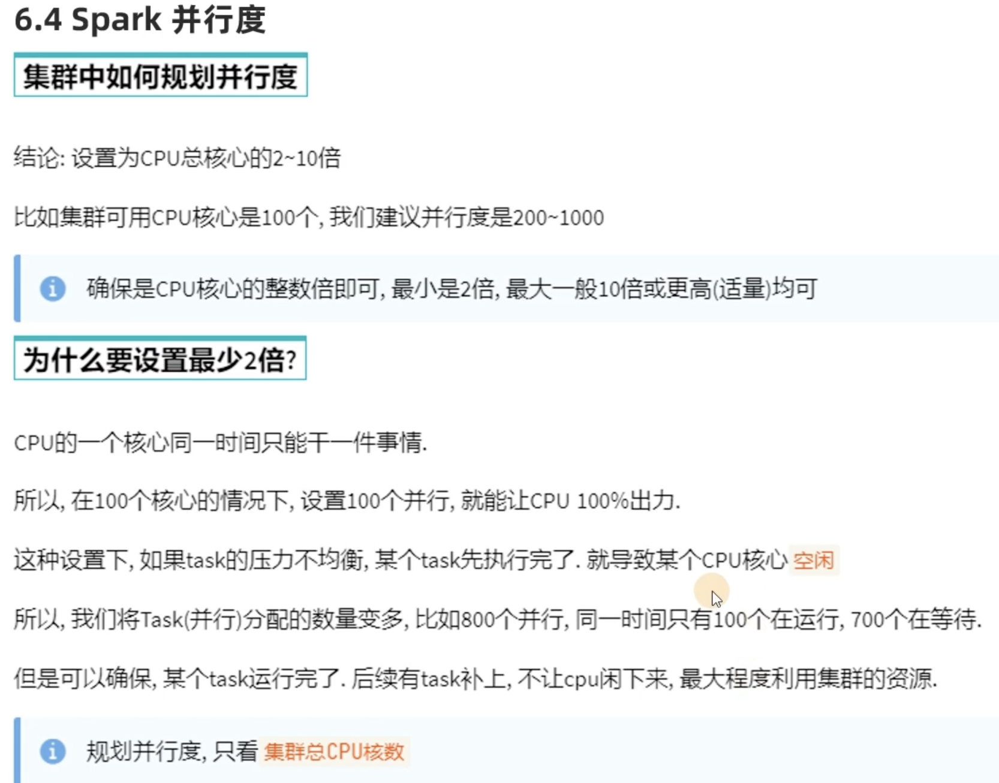


## spark任务调度
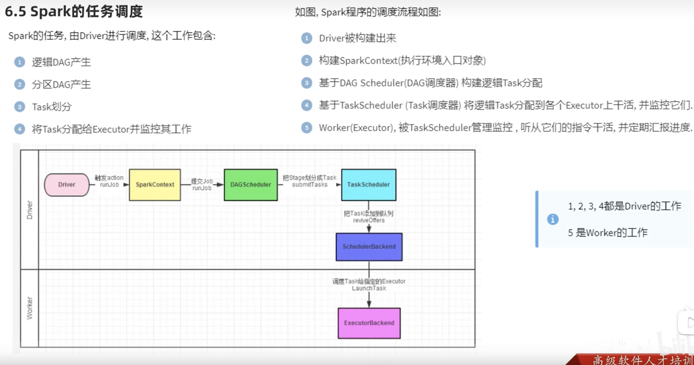

# sparksql的dataframe
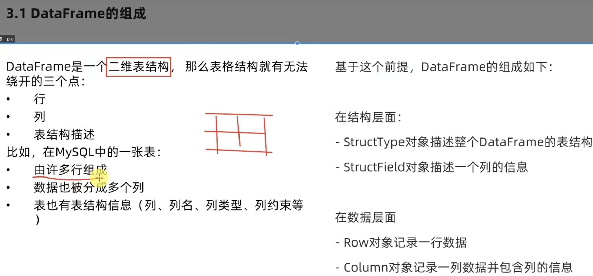
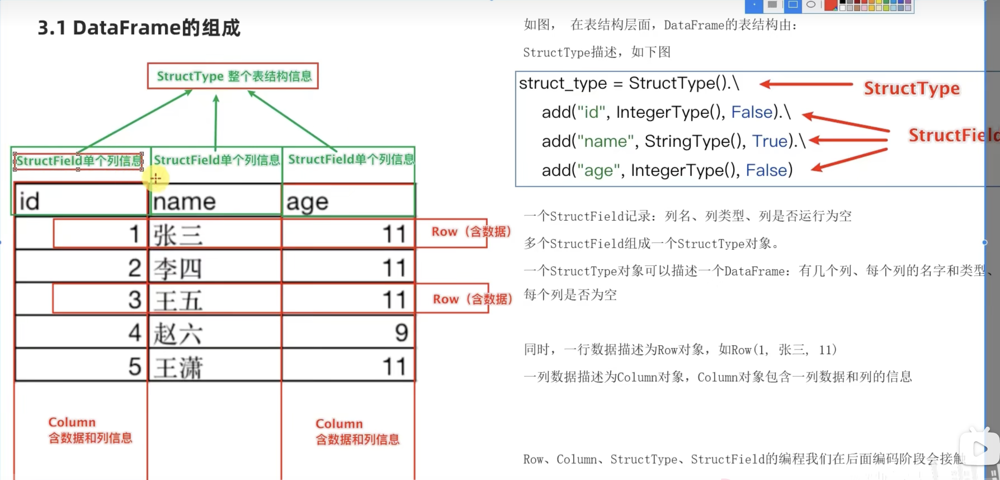

## 读取外部数据
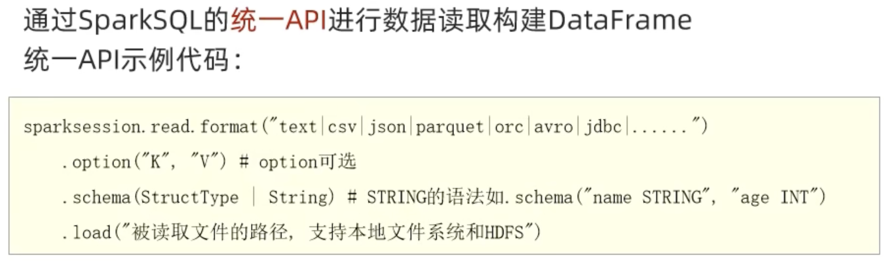

# sparksql执行逻辑
sql经过Catalyst优化器解析并优化后经由rdd执行任务
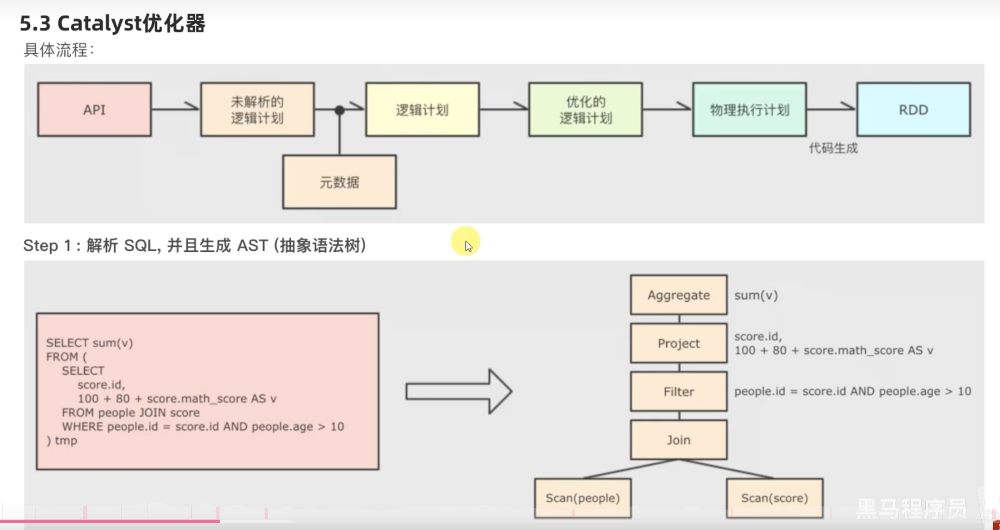

两种优化方法：
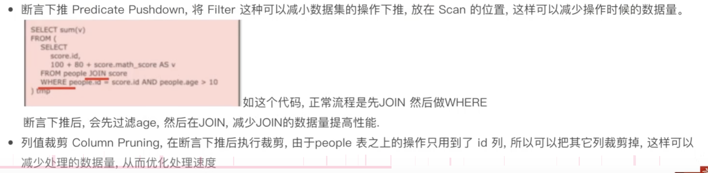


# spark on hive的原理：借用了hive的MetaStore服务
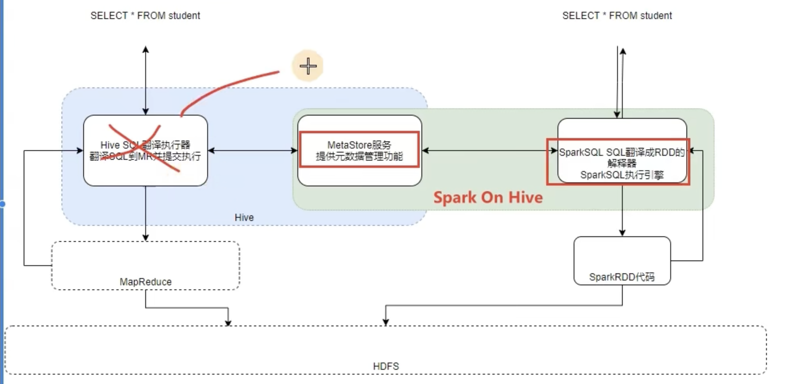

# spark的shuffle过程
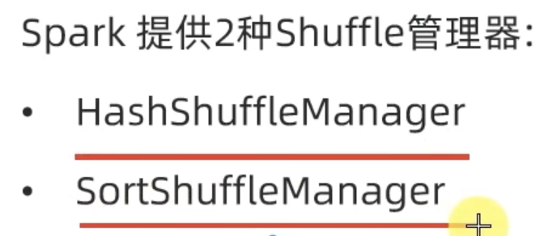

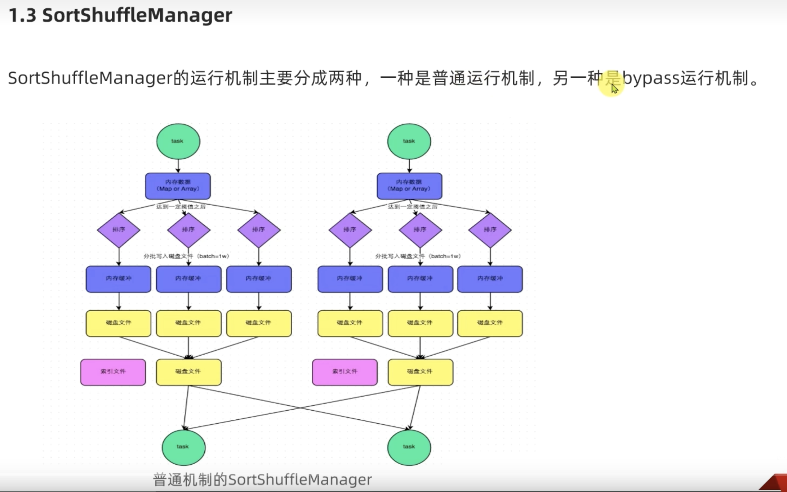

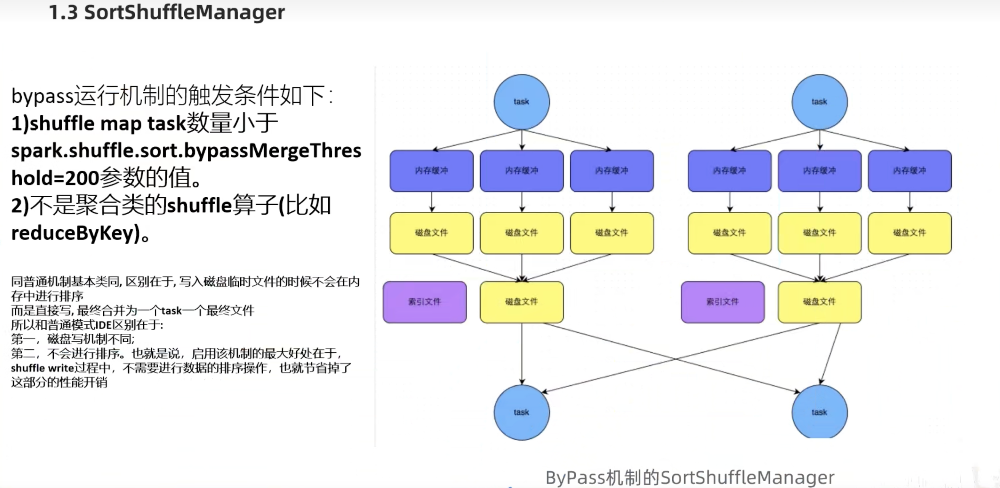

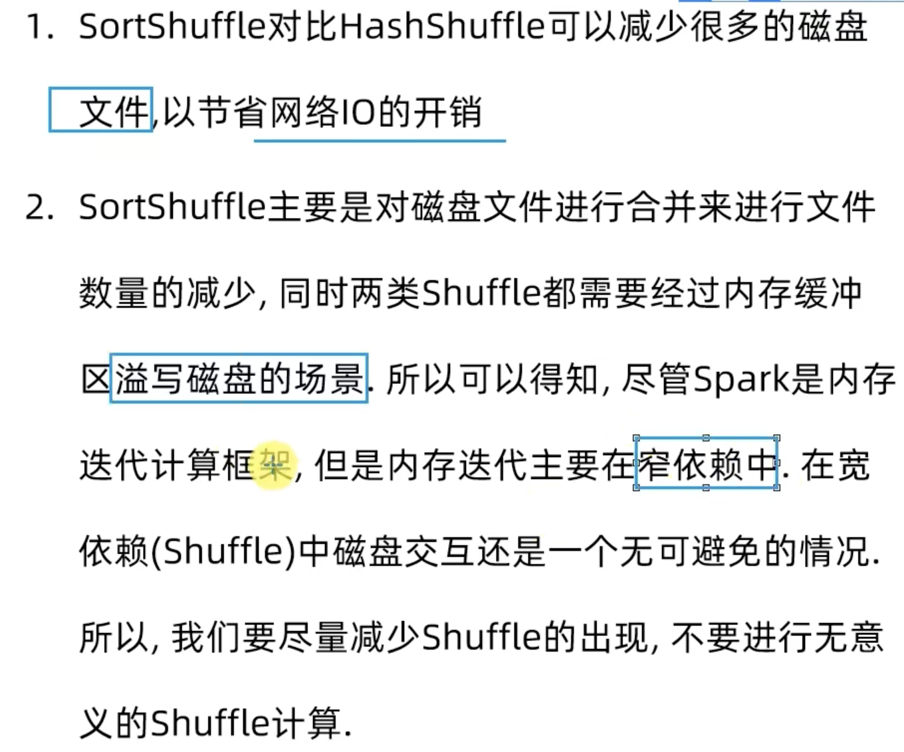

# 参数设置
1. 有多少服务器exector就设计最少多少个
2. spark.sql.shuffle.partitions，该参数指的是在sql计算中，shuffle算子阶段默认的分区数，根据集群中可用cpu核数设置，在实际项目中需要合理设置，和并行度的参数相互独立。
3. 自适应查询参数
```
set spark.sql.adaptive.enabled = true
```
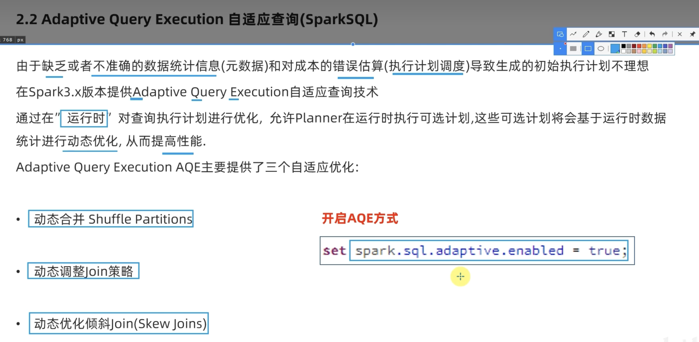
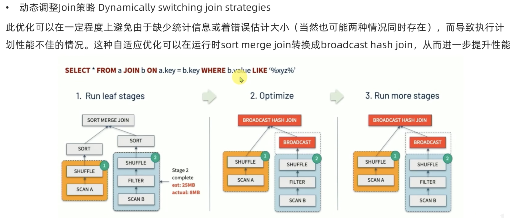
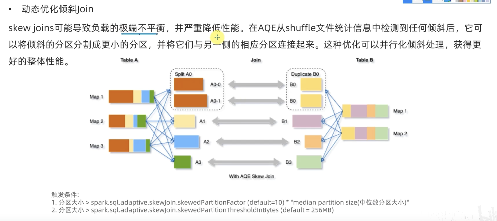
> 触发动态优化倾斜join需要满足两个条件，即图中所示，需要该分区的大小大于中位数的10倍（可调参数）以及该分区大小大于某个值（可调参数）

4. Sort Merge Join最适合用于以下情况：

- 已经排序的数据：如果数据集已经按照连接键排序，或者可以很容易地被排序，那么Sort Merge Join是一个非常好的选择。
- 大数据量：对于大数据量，Sort Merge Join可以减少数据的shuffle，从而减少网络传输和磁盘I/O，提高性能。
>配置: 在Spark中，你可以通过设置spark.sql.join.preferSortMergeJoin配置项来控制是否优先使用Sort Merge Join。如果设置为true，Spark会尽可能使用Sort Merge Join，如果设置为false，则会使用Shuffle Hash Join作为默认的连接方式。
```
spark.conf.set("spark.sql.join.preferSortMergeJoin", "true")
```