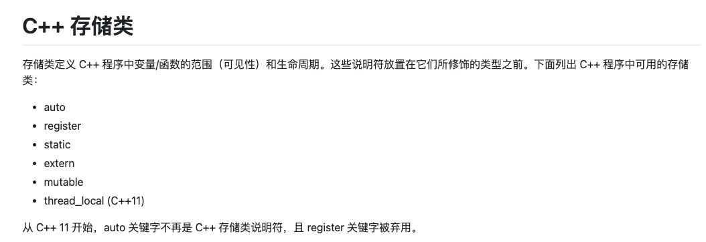
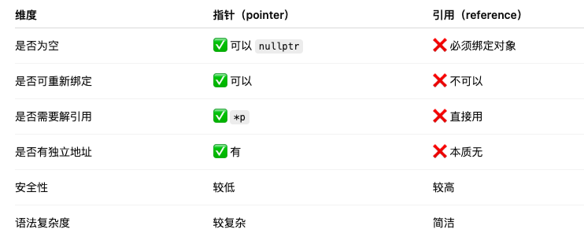
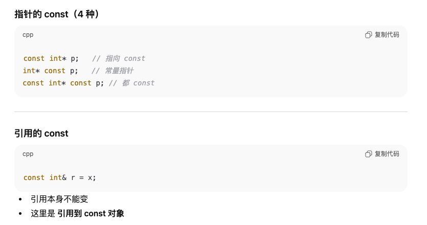

# 基础变量知识
https://github.com/0voice/cpp_new_features/blob/main/C%2B%2B%20%E5%85%A5%E9%97%A8%E6%95%99%E7%A8%8B%EF%BC%8841%E8%AF%BE%E6%97%B6%EF%BC%89%20-%20%E9%98%BF%E9%87%8C%E4%BA%91%E5%A4%A7%E5%AD%A6.md

https://github.com/applenob/Cpp_Primer_Practice/blob/master/notes/ch01.md

## #define 和 const
1. 这两者都可以定义常量，但#define定义的是宏，属于纯文本替换，编译器不感知其正确与否，没有类型和作用域

2. 宏是给预处理器使用的，编译器看不到，宏适合于条件编译，如下编译时会根据DEBUG裁剪代码，不是运行时的if语句
```
#define DEBUG

#ifdef DEBUG
  printf("debug\n");
#endif
```


## 存储类

### auto存储类
> auto 关键字用于两种情况：声明变量时根据初始化表达式自动推断该变量的类型、声明函数时函数返回值的占位符。

### static存储类
1. static修饰局部变量
> 该局部变量只会初始化一次，但作用于整个程序的周期而不会被销毁（不用static就会销毁），作用域保持不变

2. static修饰全局变量
> 不修饰时可以在在其他的文件中通过extern调用，修饰后只能在当前文件内使用。


### extern存储类
> extern 存储类用于提供一个全局变量的引用，全局变量对所有的程序文件都是可见的。当您使用 'extern' 时，对于无法初始化的变量，会把变量名指向一个之前定义过的存储位置。当您有多个文件且定义了一个可以在其他文件中使用的全局变量或函数时，可以在其他文件中使用 extern 来得到已定义的变量或函数的引用。可以这么理解，extern 是用来在另一个文件中声明一个全局变量或函数。

### mutable存储类(仅用于类的对象)


### thread_local 存储类
> 使用 thread_local 说明符声明的变量仅可在它在其上创建的线程上访问。 变量在创建线程时创建，并在销毁线程时销毁。 每个线程都有其自己的变量副本。

> 可以将 thread_local 仅应用于数据声明和定义，thread_local 不能用于函数声明或定义。


### register存储类
> register 存储类用于定义存储在寄存器中而不是 RAM 中的局部变量。寄存器只用于需要快速访问的变量，比如计数器。还应注意的是，定义 'register' 并不意味着变量将被存储在寄存器中，它意味着变量可能存储在寄存器中，这取决于硬件和实现的限制。


## 调用类


1. 指针调用的函数必须传地址，所以需要用&求地址再传入
```
void foo(int* p) {
    if (p) {
        *p = 10;
    }
}

int x = 5;
foo(&x);
```

2. 引用调用直接传值就行了
```
void foo(int& r) {
    r = 10;
}

int x = 5;
foo(x);
```


3. 四种常见的混淆case
> *前后分开看const具体是在修饰谁

