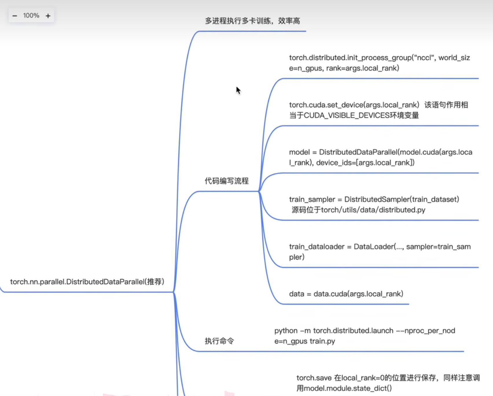
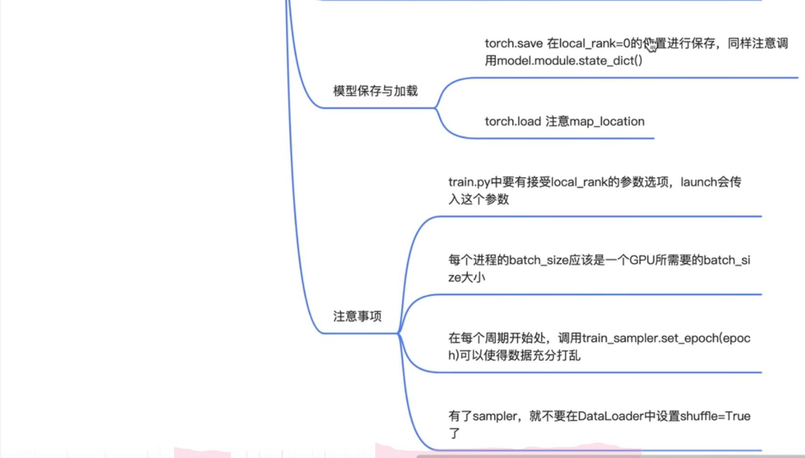
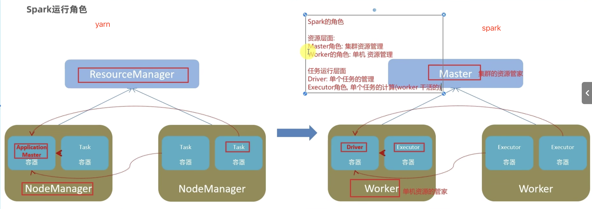
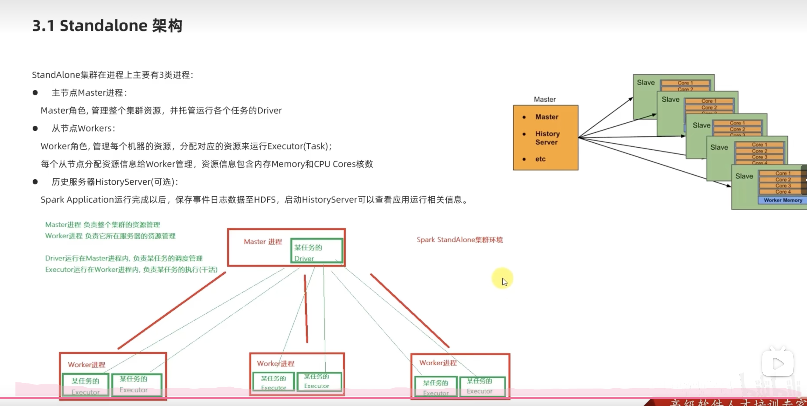
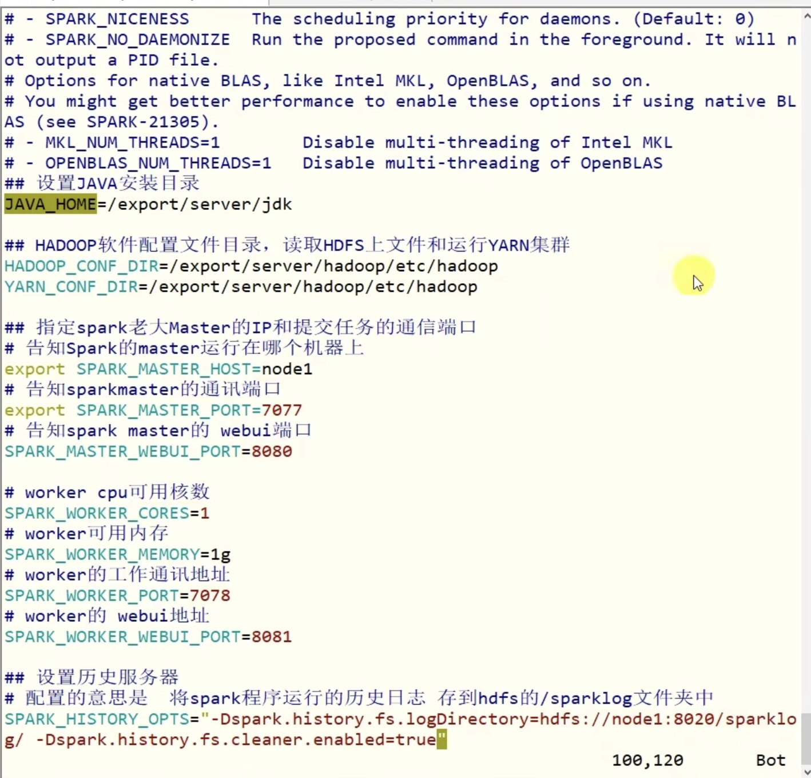

# API
单机多卡有两个api可以用，torch.nn.DataParallel已经被淘汰，现在用torch.nn.parallel.DitributedDataParallel
> 主要是通过python -m torch.distributed.launch --nproc_per_node=n_gpus train.py来实现运行 <br>
> CUDA_VISIBLE_DEVICES=0,2 python -m torch.distributed.launch --nproc_per_node=2 your_training_script.py




# 示例
> 在train_ddp.py中有成功的示例版本
```
import argparse
import torch
impotr torch.nn as nn
if __name__=='__main__':
    parser = argparse.ArgumentParser()
    parser.add_argument('--local_rank',help='local device id on current node',type=int)
    args = parser.parse_args()

    # 初始化
    n_gups = 2
    torch.distributed.init_process_group('nccl',world_size=n_gups,rank=args.local_rank)

    # 设置当前进程只用某个卡，相当于设置环境变量DUDA_VISIBLE_DEVICES
    torch.cuda.set_device(arg.local_rank)

    # 在训练板块中包裹模型，即在train()中
    model = nn.parallel.DistributedDataParallel(model.cuda(local_rank),device_ids=[local_rank])

    # 传入Dataset
    train_sampler = DistributedSampler(train_dataset)
    train_data_loader = torch.utils.data.Dataloader(train_dataset,batch_size=batch_size,collate_fn=collate_fn,sampler=train_sampler)
    eval_data_loader = torch.utils.data.Dataloader(eval_dataset,batch_size=8,collate_fn=collate_fn)

    for epoch_idx in range(num_epoch):

        train_sampler.set_epoch(epoch_idx) # 重设种子数，让每个epoch中，每个GPU得到数据随机分配
        for batch_idx,(target,token_index) in enumerate(train_data_loader):
            # 省略一些基本训练操作

            # 数据拷贝
            token_index = token_index.cuda(local_rank)
            target = target.cuda(local_rank)

            # 只在GPU:0上对模型进行保存

            if step % step_save == 0 and local_rank == 0:
                torch.save({
                    'epoch' = epoch_idx,
                    'model_state_dict' = model.module.state_dict(),
                    'optimizer_state_dict' = optimizer.state_dict()
                })

```

# Yarn和Spark对比


# Standalone架构（并行环境下）


# spark的配置文件
