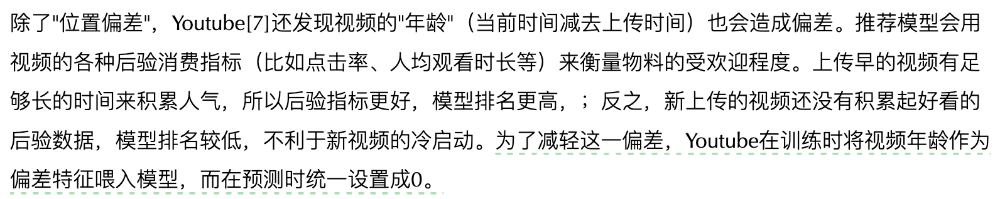

# 开篇提示
> 在工作中不要只把目光停留在模型、算法这"一亩三分地"，一定要具备全局视角，从整个推荐系统的角度来思考问题

# 缺乏了解的点
1. 流式计算系统：Apache storm是真正的分布式实时计算系统（Flink也可），响应速度在毫秒级；Apache spark streaming是微批处理的近实时处理系统，速度在秒级。
2. 在线学习系统
3. 倒排索引系统（脑子里不清晰）


# 石塔西文章阅读

## 推荐系统架构
> 功能架构：

1. 召回：主要依赖"离线计算+在线缓存"模式来实现对上百万候选集的快速筛选。（多路召回弥补精度）

2. 粗排
3. 精排：（技术集中处）

4. 重排


> 数据架构：
离线层（hdfs、spark）-> 近线层（相当于缓存，redis等KV型数据库，加速访问离线计算的结果） -> 在线层（）


## 搜索 VS 推荐
> 搜索对于响应结果的拓展性更低，推荐可以更多的进行拓展


## 搜推 VS 广告
1. 目的不同：
推搜是为了留用用户来制造流量，所以要服务的目标比较简单，就是为了给用户提供最佳使用体验。而广告是为了将流量变现，所以要兼顾用户、广告主、平台三方面的利益，参与方更多、更复杂，优化起来难度更高。
2. 转化链条不同：
推搜的目标基本上都是能够即时完成的，比如点击、完成播放等。而广告关注的目标是更深层次的"转化"。比如给用户展示一个电商APP的广告，只有用户点击广告、下载安装APP、注册、成功下单后，才算一次完完整整的"转化"。广告的转化链条越长，延时反馈的问题越严重（比如用户今天下载APP，明天才下单），最后成功转化的正样本越稀疏，建模难度越高。
3. 指标计算精度要求不同：
广告对于CTR、CVR精度要求更高，因为涉及广告费用的计算
4. 候选集量级不同：
广告的量级一般远低于搜推

## 特征提取
### 物料特征
```
物料静态特征：
    1. 物料自身直接属性
    2. 物料的类别和标签（分类模型打标或内容embedding）
```
```
物料动态特征：
    1. 物料后验统计数据（点赞数、完播率、下载量等）
    2. 用户传递来的标签（消费过该物料的用户的标签）
```
> item id也是重要的特征，模型无需理解其含义，只需要记住它就行，对于那些销量好或质量高或受欢迎的物流本身就是很强的特征（embedding）

### 用户画像
```
用户静态特征：
    1. 人口属性（年龄等）
    2. user id
```
```
用户动态特征（兴趣）：
    1. 长期兴趣（离线挖掘）
    2. 短期兴趣（在线挖掘）
```

```
特征交叉：
    1. 笛卡尔积交叉
    2. 内积交叉
```
```
偏差特征：
    如何解决？？？？？
```




## 数值特征处理


### 标准化
> 对于长尾分布的特征，先经过开方或log转化为近似正态，再进行标准化

### 数据平滑与消偏


### 分桶离散化


### 类别特征的处理


```
1. embedding可以拓展类别特征的内涵
2. 类别特征纬度特别高，但是稀疏，可以用稀疏算法解决
3. 罕见的类别特征训练数据较少，训练不充分，可以为不同的特征自适应调节训练速率
```


> 类别特征分布不均衡:


### 类别特征embedding时进行哈希映射


## 阅读心得
1. 在利用pooling提取用户行为序列中的兴趣时需要根据不同情况考虑采用pooling的方式：在召回时，缺乏候选物料信息，适合采用简单的pooling方式（例如sum pooling）；在精排时，可以将候选物料信息当作query来挖掘行为序列中对应的兴趣，从而进行自适应的pooling。（若没有候选物料，可以将行为序列的最后一个物料作为query来衡量整个行为序列）

2. 