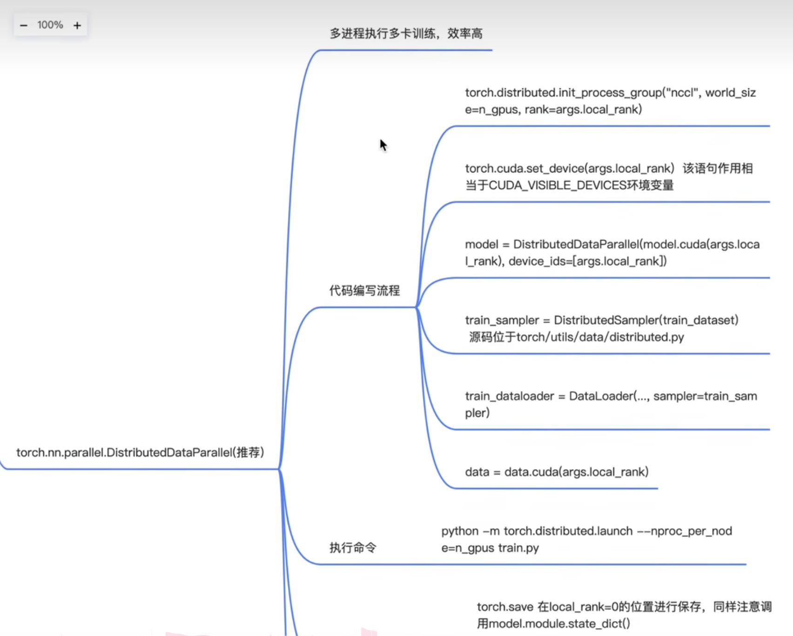
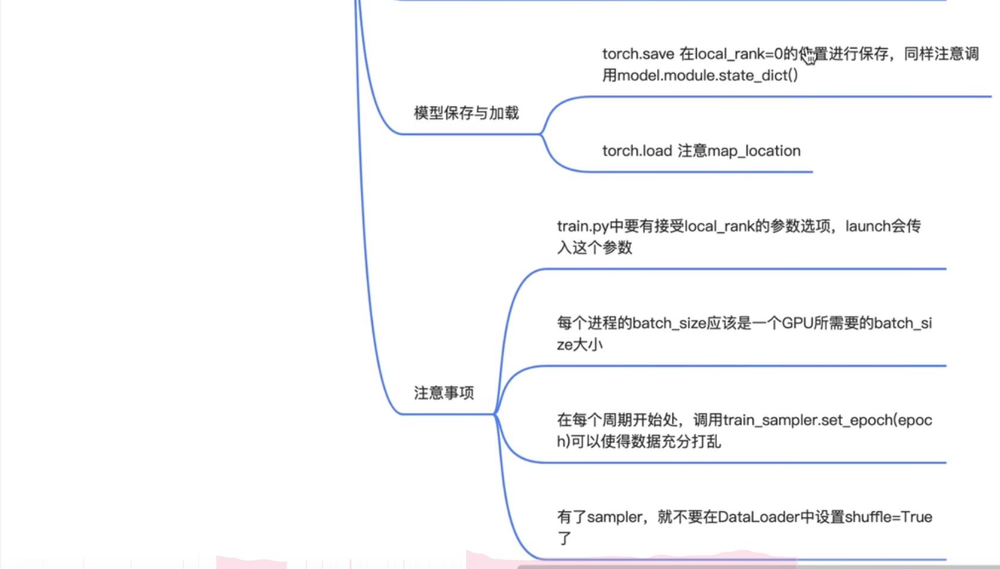

# API
单机多卡有两个api可以用，torch.nn.DataParallel已经被淘汰，现在用torch.nn.parallel.DitributedDataParallel
> 主要是通过python -m torch.distributed.launch --nproc_per_node=n_gpus train.py来实现运行




# 示例
```
import argparse
import torch
if __name__=='__main__':
    parser = argparse.ArgumentParser()
    parser.add_argument('--local_rank',help='local device id on current node',type=int)
    args = parser.parse_args()

    # 初始化
    n_gups = 2
    torch.distributed.init_process_group('nccl',world_size=n_gups,rank=args.local_rank)
```
